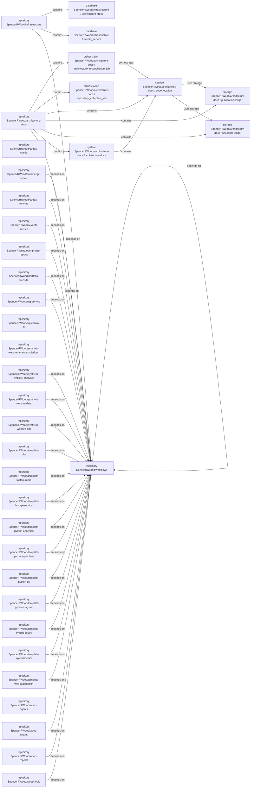

# Architecture Overview

Generation state: **complete**. Publication blocked: **false**.

Declarations describe repository intent; they do not attest deployed health.

## Summary

| Item | Deterministic evidence | Evidence state | Sources |
| --- | --- | --- | --- |
| Document scope | Major systems, runtime boundaries and significant interactions. 29 represented repositories \(5 core, 9 service, 15 supporting\). Architecture categories: automation and orchestration, data and storage, repository dependencies, systems and runtime. Declared technologies: dagster, postgresql, python. Shared persistence boundaries: SpencerRWood/architecture-docs / publication-ledger; SpencerRWood/architecture-docs / snapshot-ledger; SpencerRWood/infrastructure / architecture\_docs; SpencerRWood/infrastructure / events\_service. 24 significant cross-repository relationships. Estate coverage: complete\_with\_gaps; 0 material unresolved evidence gaps. Missing declarations remain gaps; supporting files alone do not establish procedures. | derived | — |

## Repositories and major system boundaries

| Item | Deterministic evidence | Evidence state | Sources |
| --- | --- | --- | --- |
| database SpencerRWood/infrastructure / architecture\_docs | Declared entity | verified | [^18] |
| architecture\_docs / technology | postgresql | agreed; verified | [^18] |
| database SpencerRWood/infrastructure / events\_service | Declared entity | verified | [^18] |
| events\_service / technology | postgresql | agreed; verified | [^18] |
| orchestration SpencerRWood/architecture-docs / architecture\_reconciliation\_job | Declared entity | verified | [^71] |
| orchestration SpencerRWood/architecture-docs / repository\_collection\_job | Declared entity | verified | [^71] |
| repository SpencerRWood/architecture-docs | Declared entity | verified | [^1] |
| repository SpencerRWood/automerge-repair | Declared entity | verified | [^4] |
| repository SpencerRWood/codex-config | Declared entity | verified | [^7] |
| repository SpencerRWood/codex-runtime | Declared entity | verified | [^8] |
| repository SpencerRWood/events-service | Declared entity | verified | [^11] |
| repository SpencerRWood/infrastructure | Declared entity | verified | [^14] |
| repository SpencerRWood/openproject-reports | Declared entity | verified | [^19] |
| repository SpencerRWood/portfolio-website | Declared entity | verified | [^22] |
| repository SpencerRWood/rag-service | Declared entity | verified | [^25] |
| repository SpencerRWood/sql-control-cli | Declared entity | verified | [^28] |
| repository SpencerRWood/synthetic-website-analytics-platform | Declared entity | verified | [^30] |
| repository SpencerRWood/synthetic-website-analytics | Declared entity | verified | [^29] |
| repository SpencerRWood/synthetic-website-data | Declared entity | verified | [^32] |
| repository SpencerRWood/synthetic-website-dbt | Declared entity | verified | [^34] |
| repository SpencerRWood/template-dbt | Declared entity | verified | [^36] |
| repository SpencerRWood/template-fastapi-react | Declared entity | verified | [^38] |
| repository SpencerRWood/template-fastapi-service | Declared entity | verified | [^41] |
| repository SpencerRWood/template-python-analytics | Declared entity | verified | [^44] |
| repository SpencerRWood/template-python-api-client | Declared entity | verified | [^46] |
| repository SpencerRWood/template-python-cli | Declared entity | verified | [^48] |
| repository SpencerRWood/template-python-dagster | Declared entity | verified | [^50] |
| repository SpencerRWood/template-python-library | Declared entity | verified | [^53] |
| repository SpencerRWood/template-synthetic-data | Declared entity | verified | [^55] |
| repository SpencerRWood/template-web-automation | Declared entity | verified | [^57] |
| repository SpencerRWood/wood-agents | Declared entity | verified | [^59] |
| repository SpencerRWood/wood-charts | Declared entity | verified | [^60] |
| repository SpencerRWood/wood-reports | Declared entity | verified | [^62] |
| repository SpencerRWood/wood-tools | Declared entity | verified | [^65] |
| repository SpencerRWood/workflows | Declared entity | verified | [^68] |
| service SpencerRWood/architecture-docs / code-location | Declared entity | verified | [^71] |
| code-location / technology | dagster | agreed; verified | [^71] |
| storage SpencerRWood/architecture-docs / publication-ledger | Declared entity | verified | [^71] |
| publication-ledger / technology | postgresql | agreed; verified | [^71] |
| storage SpencerRWood/architecture-docs / snapshot-ledger | Declared entity | verified | [^71] |
| snapshot-ledger / technology | postgresql | agreed; verified | [^71] |
| system SpencerRWood/architecture-docs / architecture-docs | Declared entity | verified | [^71] |
| architecture-docs / technology | python | agreed; verified | [^71] |

## Typed architecture relationships

| Item | Deterministic evidence | Evidence state | Sources |
| --- | --- | --- | --- |
| contains | repository SpencerRWood/architecture-docs contains orchestration SpencerRWood/architecture-docs / architecture\_reconciliation\_job | declared; verified | [^71] |
| contains | repository SpencerRWood/architecture-docs contains orchestration SpencerRWood/architecture-docs / repository\_collection\_job | declared; verified | [^71] |
| contains | repository SpencerRWood/architecture-docs contains service SpencerRWood/architecture-docs / code-location | declared; verified | [^71] |
| contains | repository SpencerRWood/architecture-docs contains storage SpencerRWood/architecture-docs / publication-ledger | declared; verified | [^71] |
| contains | repository SpencerRWood/architecture-docs contains storage SpencerRWood/architecture-docs / snapshot-ledger | declared; verified | [^71] |
| contains | repository SpencerRWood/architecture-docs contains system SpencerRWood/architecture-docs / architecture-docs | declared; verified | [^71] |
| contains | repository SpencerRWood/infrastructure contains database SpencerRWood/infrastructure / architecture\_docs | declared; verified | [^18] |
| contains | repository SpencerRWood/infrastructure contains database SpencerRWood/infrastructure / events\_service | declared; verified | [^18] |
| contains | system SpencerRWood/architecture-docs / architecture-docs contains service SpencerRWood/architecture-docs / code-location | declared; verified | [^71] |
| depends\_on | repository SpencerRWood/architecture-docs depends on repository SpencerRWood/workflows | declared; verified | [^3] [^2] |
| depends\_on | repository SpencerRWood/automerge-repair depends on repository SpencerRWood/workflows | declared; verified | [^6] [^5] |
| depends\_on | repository SpencerRWood/codex-runtime depends on repository SpencerRWood/workflows | declared; verified | [^10] [^9] |
| depends\_on | repository SpencerRWood/events-service depends on repository SpencerRWood/workflows | declared; verified | [^13] [^12] |
| depends\_on | repository SpencerRWood/infrastructure depends on repository SpencerRWood/workflows | declared; verified | [^17] [^16] [^15] |
| depends\_on | repository SpencerRWood/openproject-reports depends on repository SpencerRWood/workflows | declared; verified | [^20] [^21] |
| depends\_on | repository SpencerRWood/portfolio-website depends on repository SpencerRWood/workflows | declared; verified | [^24] [^23] |
| depends\_on | repository SpencerRWood/rag-service depends on repository SpencerRWood/workflows | declared; verified | [^26] [^27] |
| depends\_on | repository SpencerRWood/synthetic-website-analytics depends on repository SpencerRWood/workflows | declared; verified | [^31] |
| depends\_on | repository SpencerRWood/synthetic-website-data depends on repository SpencerRWood/workflows | declared; verified | [^33] |
| depends\_on | repository SpencerRWood/synthetic-website-dbt depends on repository SpencerRWood/workflows | declared; verified | [^35] |
| depends\_on | repository SpencerRWood/template-dbt depends on repository SpencerRWood/workflows | declared; verified | [^37] |
| depends\_on | repository SpencerRWood/template-fastapi-react depends on repository SpencerRWood/workflows | declared; verified | [^39] [^40] |
| depends\_on | repository SpencerRWood/template-fastapi-service depends on repository SpencerRWood/workflows | declared; verified | [^42] [^43] |
| depends\_on | repository SpencerRWood/template-python-analytics depends on repository SpencerRWood/workflows | declared; verified | [^45] |
| depends\_on | repository SpencerRWood/template-python-api-client depends on repository SpencerRWood/workflows | declared; verified | [^47] |
| depends\_on | repository SpencerRWood/template-python-cli depends on repository SpencerRWood/workflows | declared; verified | [^49] |
| depends\_on | repository SpencerRWood/template-python-dagster depends on repository SpencerRWood/workflows | declared; verified | [^51] [^52] |
| depends\_on | repository SpencerRWood/template-python-library depends on repository SpencerRWood/workflows | declared; verified | [^54] |
| depends\_on | repository SpencerRWood/template-synthetic-data depends on repository SpencerRWood/workflows | declared; verified | [^56] |
| depends\_on | repository SpencerRWood/template-web-automation depends on repository SpencerRWood/workflows | declared; verified | [^58] |
| depends\_on | repository SpencerRWood/wood-charts depends on repository SpencerRWood/workflows | declared; verified | [^61] |
| depends\_on | repository SpencerRWood/wood-reports depends on repository SpencerRWood/workflows | declared; verified | [^64] [^63] |
| depends\_on | repository SpencerRWood/wood-tools depends on repository SpencerRWood/workflows | declared; verified | [^67] [^66] |
| depends\_on | repository SpencerRWood/workflows depends on repository SpencerRWood/workflows | declared; verified | [^70] [^69] |
| orchestrates | orchestration SpencerRWood/architecture-docs / architecture\_reconciliation\_job orchestrates service SpencerRWood/architecture-docs / code-location | declared; verified | [^71] |
| uses\_storage | service SpencerRWood/architecture-docs / code-location uses storage storage SpencerRWood/architecture-docs / publication-ledger | declared; verified | [^71] |
| uses\_storage | service SpencerRWood/architecture-docs / code-location uses storage storage SpencerRWood/architecture-docs / snapshot-ledger | declared; verified | [^71] |

## Estate coverage

| Item | Deterministic evidence | Evidence state | Sources |
| --- | --- | --- | --- |
| Estate coverage | complete\_with\_gaps | verified | — |

## Source provenance

[^1]: [GitHub: SpencerRWood/architecture-docs / repository metadata](https://github.com/SpencerRWood/architecture-docs); verified.
[^2]: [GitHub: SpencerRWood/architecture-docs/.github/workflows/release.yml](https://github.com/SpencerRWood/architecture-docs/blob/3f0a52d5ed6f/.github/workflows/release.yml); verified.
[^3]: [GitHub: SpencerRWood/architecture-docs/.github/workflows/validate.yml](https://github.com/SpencerRWood/architecture-docs/blob/3f0a52d5ed6f/.github/workflows/validate.yml); verified.
[^4]: [GitHub: SpencerRWood/automerge-repair / repository metadata](https://github.com/SpencerRWood/automerge-repair); verified.
[^5]: [GitHub: SpencerRWood/automerge-repair/.github/workflows/release.yml](https://github.com/SpencerRWood/automerge-repair/blob/b39d47432241/.github/workflows/release.yml); verified.
[^6]: [GitHub: SpencerRWood/automerge-repair/.github/workflows/validate.yml](https://github.com/SpencerRWood/automerge-repair/blob/b39d47432241/.github/workflows/validate.yml); verified.
[^7]: [GitHub: SpencerRWood/codex-config / repository metadata](https://github.com/SpencerRWood/codex-config); verified.
[^8]: [GitHub: SpencerRWood/codex-runtime / repository metadata](https://github.com/SpencerRWood/codex-runtime); verified.
[^9]: [GitHub: SpencerRWood/codex-runtime/.github/workflows/release.yml](https://github.com/SpencerRWood/codex-runtime/blob/e596a4c47734/.github/workflows/release.yml); verified.
[^10]: [GitHub: SpencerRWood/codex-runtime/.github/workflows/validate.yml](https://github.com/SpencerRWood/codex-runtime/blob/e596a4c47734/.github/workflows/validate.yml); verified.
[^11]: [GitHub: SpencerRWood/events-service / repository metadata](https://github.com/SpencerRWood/events-service); verified.
[^12]: [GitHub: SpencerRWood/events-service/.github/workflows/release.yml](https://github.com/SpencerRWood/events-service/blob/532a97cef6ba/.github/workflows/release.yml); verified.
[^13]: [GitHub: SpencerRWood/events-service/.github/workflows/validate.yml](https://github.com/SpencerRWood/events-service/blob/532a97cef6ba/.github/workflows/validate.yml); verified.
[^14]: [GitHub: SpencerRWood/infrastructure / repository metadata](https://github.com/SpencerRWood/infrastructure); verified.
[^15]: [GitHub: SpencerRWood/infrastructure/.github/workflows/deploy.yml](https://github.com/SpencerRWood/infrastructure/blob/ecec2f31f762/.github/workflows/deploy.yml); verified.
[^16]: [GitHub: SpencerRWood/infrastructure/.github/workflows/release.yml](https://github.com/SpencerRWood/infrastructure/blob/ecec2f31f762/.github/workflows/release.yml); verified.
[^17]: [GitHub: SpencerRWood/infrastructure/.github/workflows/validate.yml](https://github.com/SpencerRWood/infrastructure/blob/ecec2f31f762/.github/workflows/validate.yml); verified.
[^18]: [GitHub: SpencerRWood/infrastructure/environments/dev.yml](https://github.com/SpencerRWood/infrastructure/blob/ecec2f31f762/environments/dev.yml); verified.
[^19]: [GitHub: SpencerRWood/openproject-reports / repository metadata](https://github.com/SpencerRWood/openproject-reports); verified.
[^20]: [GitHub: SpencerRWood/openproject-reports/.github/workflows/release.yml](https://github.com/SpencerRWood/openproject-reports/blob/a907c22c7c6c/.github/workflows/release.yml); verified.
[^21]: [GitHub: SpencerRWood/openproject-reports/.github/workflows/validate.yml](https://github.com/SpencerRWood/openproject-reports/blob/a907c22c7c6c/.github/workflows/validate.yml); verified.
[^22]: [GitHub: SpencerRWood/portfolio-website / repository metadata](https://github.com/SpencerRWood/portfolio-website); verified.
[^23]: [GitHub: SpencerRWood/portfolio-website/.github/workflows/release.yml](https://github.com/SpencerRWood/portfolio-website/blob/442b8319f66b/.github/workflows/release.yml); verified.
[^24]: [GitHub: SpencerRWood/portfolio-website/.github/workflows/validate.yml](https://github.com/SpencerRWood/portfolio-website/blob/442b8319f66b/.github/workflows/validate.yml); verified.
[^25]: [GitHub: SpencerRWood/rag-service / repository metadata](https://github.com/SpencerRWood/rag-service); verified.
[^26]: [GitHub: SpencerRWood/rag-service/.github/workflows/release.yml](https://github.com/SpencerRWood/rag-service/blob/d4162ee324b4/.github/workflows/release.yml); verified.
[^27]: [GitHub: SpencerRWood/rag-service/.github/workflows/validate.yml](https://github.com/SpencerRWood/rag-service/blob/d4162ee324b4/.github/workflows/validate.yml); verified.
[^28]: [GitHub: SpencerRWood/sql-control-cli / repository metadata](https://github.com/SpencerRWood/sql-control-cli); verified.
[^29]: [GitHub: SpencerRWood/synthetic-website-analytics / repository metadata](https://github.com/SpencerRWood/synthetic-website-analytics); verified.
[^30]: [GitHub: SpencerRWood/synthetic-website-analytics-platform / repository metadata](https://github.com/SpencerRWood/synthetic-website-analytics-platform); verified.
[^31]: [GitHub: SpencerRWood/synthetic-website-analytics/.github/workflows/release.yml](https://github.com/SpencerRWood/synthetic-website-analytics/blob/bd0ab0a5d362/.github/workflows/release.yml); verified.
[^32]: [GitHub: SpencerRWood/synthetic-website-data / repository metadata](https://github.com/SpencerRWood/synthetic-website-data); verified.
[^33]: [GitHub: SpencerRWood/synthetic-website-data/.github/workflows/release.yml](https://github.com/SpencerRWood/synthetic-website-data/blob/fc805ca604c2/.github/workflows/release.yml); verified.
[^34]: [GitHub: SpencerRWood/synthetic-website-dbt / repository metadata](https://github.com/SpencerRWood/synthetic-website-dbt); verified.
[^35]: [GitHub: SpencerRWood/synthetic-website-dbt/.github/workflows/release.yml](https://github.com/SpencerRWood/synthetic-website-dbt/blob/c3b8e5c5e108/.github/workflows/release.yml); verified.
[^36]: [GitHub: SpencerRWood/template-dbt / repository metadata](https://github.com/SpencerRWood/template-dbt); verified.
[^37]: [GitHub: SpencerRWood/template-dbt/.github/workflows/release.yml](https://github.com/SpencerRWood/template-dbt/blob/015c7fd7548b/.github/workflows/release.yml); verified.
[^38]: [GitHub: SpencerRWood/template-fastapi-react / repository metadata](https://github.com/SpencerRWood/template-fastapi-react); verified.
[^39]: [GitHub: SpencerRWood/template-fastapi-react/.github/workflows/release.yml](https://github.com/SpencerRWood/template-fastapi-react/blob/1db84898496f/.github/workflows/release.yml); verified.
[^40]: [GitHub: SpencerRWood/template-fastapi-react/.github/workflows/validate.yml](https://github.com/SpencerRWood/template-fastapi-react/blob/1db84898496f/.github/workflows/validate.yml); verified.
[^41]: [GitHub: SpencerRWood/template-fastapi-service / repository metadata](https://github.com/SpencerRWood/template-fastapi-service); verified.
[^42]: [GitHub: SpencerRWood/template-fastapi-service/.github/workflows/release.yml](https://github.com/SpencerRWood/template-fastapi-service/blob/f27a9c1fb4a1/.github/workflows/release.yml); verified.
[^43]: [GitHub: SpencerRWood/template-fastapi-service/.github/workflows/validate.yml](https://github.com/SpencerRWood/template-fastapi-service/blob/f27a9c1fb4a1/.github/workflows/validate.yml); verified.
[^44]: [GitHub: SpencerRWood/template-python-analytics / repository metadata](https://github.com/SpencerRWood/template-python-analytics); verified.
[^45]: [GitHub: SpencerRWood/template-python-analytics/.github/workflows/release.yml](https://github.com/SpencerRWood/template-python-analytics/blob/f642c2e2844f/.github/workflows/release.yml); verified.
[^46]: [GitHub: SpencerRWood/template-python-api-client / repository metadata](https://github.com/SpencerRWood/template-python-api-client); verified.
[^47]: [GitHub: SpencerRWood/template-python-api-client/.github/workflows/release.yml](https://github.com/SpencerRWood/template-python-api-client/blob/7dfe01a1f7ad/.github/workflows/release.yml); verified.
[^48]: [GitHub: SpencerRWood/template-python-cli / repository metadata](https://github.com/SpencerRWood/template-python-cli); verified.
[^49]: [GitHub: SpencerRWood/template-python-cli/.github/workflows/release.yml](https://github.com/SpencerRWood/template-python-cli/blob/1596609f095d/.github/workflows/release.yml); verified.
[^50]: [GitHub: SpencerRWood/template-python-dagster / repository metadata](https://github.com/SpencerRWood/template-python-dagster); verified.
[^51]: [GitHub: SpencerRWood/template-python-dagster/.github/workflows/release.yml](https://github.com/SpencerRWood/template-python-dagster/blob/2b7d901e6309/.github/workflows/release.yml); verified.
[^52]: [GitHub: SpencerRWood/template-python-dagster/.github/workflows/validate.yml](https://github.com/SpencerRWood/template-python-dagster/blob/2b7d901e6309/.github/workflows/validate.yml); verified.
[^53]: [GitHub: SpencerRWood/template-python-library / repository metadata](https://github.com/SpencerRWood/template-python-library); verified.
[^54]: [GitHub: SpencerRWood/template-python-library/.github/workflows/release.yml](https://github.com/SpencerRWood/template-python-library/blob/f397b22d6aee/.github/workflows/release.yml); verified.
[^55]: [GitHub: SpencerRWood/template-synthetic-data / repository metadata](https://github.com/SpencerRWood/template-synthetic-data); verified.
[^56]: [GitHub: SpencerRWood/template-synthetic-data/.github/workflows/release.yml](https://github.com/SpencerRWood/template-synthetic-data/blob/76c387688fa1/.github/workflows/release.yml); verified.
[^57]: [GitHub: SpencerRWood/template-web-automation / repository metadata](https://github.com/SpencerRWood/template-web-automation); verified.
[^58]: [GitHub: SpencerRWood/template-web-automation/.github/workflows/release.yml](https://github.com/SpencerRWood/template-web-automation/blob/1d2d0bab5ec5/.github/workflows/release.yml); verified.
[^59]: [GitHub: SpencerRWood/wood-agents / repository metadata](https://github.com/SpencerRWood/wood-agents); verified.
[^60]: [GitHub: SpencerRWood/wood-charts / repository metadata](https://github.com/SpencerRWood/wood-charts); verified.
[^61]: [GitHub: SpencerRWood/wood-charts/.github/workflows/release.yml](https://github.com/SpencerRWood/wood-charts/blob/f8db26d260ea/.github/workflows/release.yml); verified.
[^62]: [GitHub: SpencerRWood/wood-reports / repository metadata](https://github.com/SpencerRWood/wood-reports); verified.
[^63]: [GitHub: SpencerRWood/wood-reports/.github/workflows/release.yml](https://github.com/SpencerRWood/wood-reports/blob/94044e680c59/.github/workflows/release.yml); verified.
[^64]: [GitHub: SpencerRWood/wood-reports/.github/workflows/validate.yml](https://github.com/SpencerRWood/wood-reports/blob/94044e680c59/.github/workflows/validate.yml); verified.
[^65]: [GitHub: SpencerRWood/wood-tools / repository metadata](https://github.com/SpencerRWood/wood-tools); verified.
[^66]: [GitHub: SpencerRWood/wood-tools/.github/workflows/release.yml](https://github.com/SpencerRWood/wood-tools/blob/e6e888208cd2/.github/workflows/release.yml); verified.
[^67]: [GitHub: SpencerRWood/wood-tools/.github/workflows/validate.yml](https://github.com/SpencerRWood/wood-tools/blob/e6e888208cd2/.github/workflows/validate.yml); verified.
[^68]: [GitHub: SpencerRWood/workflows / repository metadata](https://github.com/SpencerRWood/workflows); verified.
[^69]: [GitHub: SpencerRWood/workflows/.github/workflows/release-container.yml](https://github.com/SpencerRWood/workflows/blob/51100f648c0e/.github/workflows/release-container.yml); verified.
[^70]: [GitHub: SpencerRWood/workflows/.github/workflows/release.yml](https://github.com/SpencerRWood/workflows/blob/51100f648c0e/.github/workflows/release.yml); verified.
[^71]: Local worktree: SpencerRWood/architecture-docs/architecture.toml; verified; uncommitted.
