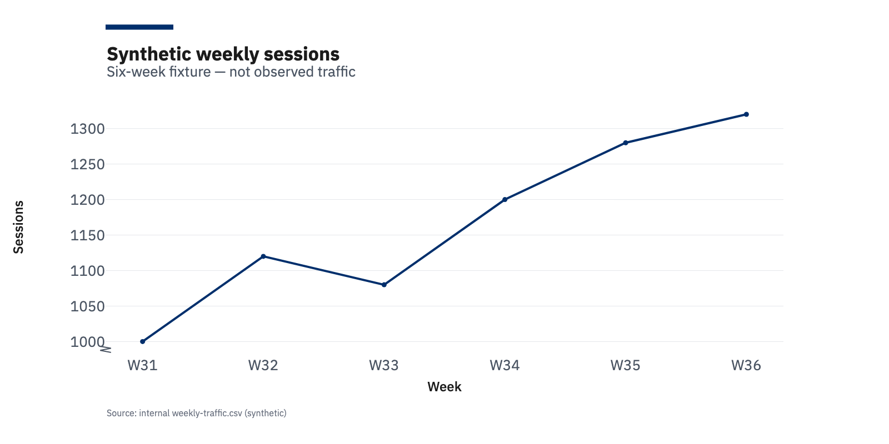

## Executive Summary

The six-week synthetic fixture contains **7,000 sessions** and **280 conversions**.
The aggregate conversion rate is **4.00%**. Sessions increase from 1,000 to 1,320
between the first and final weeks, a 32% change within this invented dataset.

> [!FINDING] The fixture demonstrates growth with a temporary week-three dip. It does not establish a real marketing effect or business outcome.

## Business Question or Objective

Show how a recurring report connects a business question, reproducible data,
a publication table, a Wood Charts visualization, and a qualified recommendation.

## Data and Methodology

The source is `weekly-traffic.csv`, an explicitly synthetic six-row fixture stored
with this corpus. Sessions and conversions are integer counts. The aggregate
conversion rate is total conversions divided by total sessions; it is not an
unweighted average of weekly percentages.

### Source ownership

The example owns its data and chart construction. Wood Reports owns assembly,
validation, branding, compilation, and packaging. See the pinned
[integration guide](https://github.com/SpencerRWood/wood-reports/blob/v0.20.0/docs/production-analytics-integration.md).

## Key Metrics

| Week | Sessions | Conversions |
| --- | ---: | ---: |
| W31 | 1000 | 40 |
| W32 | 1120 | 45 |
| W33 | 1080 | 43 |
| W34 | 1200 | 48 |
| W35 | 1280 | 51 |
| W36 | 1320 | 53 |

## Findings

### Session pattern

Sessions decrease by 40 between W32 and W33, then increase in each remaining
week. The chart below uses the same six values as the table above.

Source: `weekly-traffic.csv`; chart generator: `generate_chart.py` using the pinned
Wood Charts base theme. Values are synthetic; no causal explanation is implied.

## Interpretation

The table supports exact-value lookup while the figure makes the weekly pattern
visible. Their shared Navy and Blue palette illustrates alignment between
chart-intrinsic styling and the centralized Wood Reports publication theme.

## Recommendations or Implications

> [!RECOMMENDATION] Use this fixture to review reporting clarity. Replace it with approved, independently verified data before making a business decision.

## Limitations

There is no attribution model, experiment, uncertainty estimate, or real customer
information in the fixture. The six observations are intentionally small enough
to check by hand. A successful compilation does not validate an analytical claim.

## Appendix

### Reproduction and references

Generate the PNG with the included `generate_chart.py`. The Markdown chart
reference resolves to that local artifact before publication; the CLSI compiler
receives a caller-supplied resource URL for the identical PNG bytes.

The [Wood Charts v0.3.0 source](https://github.com/SpencerRWood/wood-charts/tree/v0.3.0)
owns chart rendering. The [Wood Reports release contract](https://github.com/SpencerRWood/wood-reports/blob/v0.20.0/docs/pdf-releases.md)
owns PDF gates and artifact integrity. These are ordinary supported Markdown
source links, not a bibliography-processing feature.
